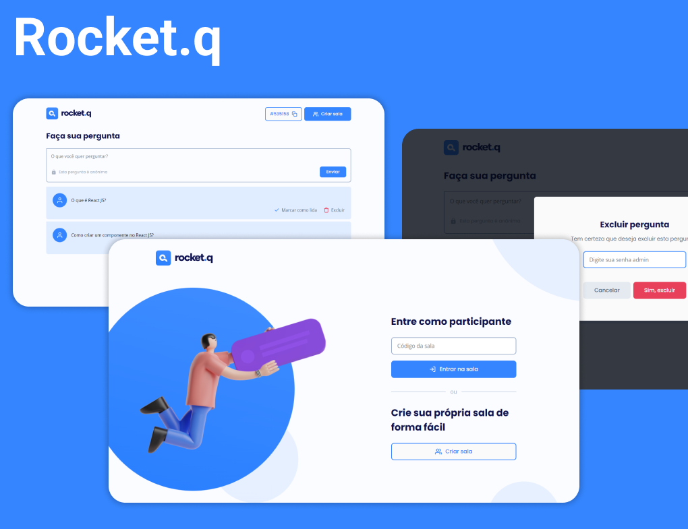

<p align="center">
  
</p>

## 🚀 Tecnologias

Para esse projeto foi usado o padrão MVC, e as seguintes techs:

- JavaScript
- NodeJS
- Express
- EJS
- HTML
- CSS
- SQLite

## 💻 Projeto

A ideia da aplicação é criar salas para receber e gerenciar perguntas de outros usuários. As salas podem ser compartilhadas e acessadas através do código gerado para cada uma.

A aplicação pode ser usada, por exemplo, para receber perguntas em uma live, em que o admin pode marcar perguntas como respondidas, a fim de ter um controle da vizualização das que não foram atendidas, e também apagar se for preciso.

Algumas das melhorias adicionadas foram:

- validar formulários e exibir erros
- possibilitar cópia do código da sala clicando nele
- exibir toasts de confirmação e de erros
- proteger as rotas e exibir uma página 404

## Rodando localmente

1. Clone esse repositório.

2. Navegue até a pasta do projeto:

```sh
  cd ./nlw-together-discover-upgrade
```

3. Instale as dependências:

```sh
  npm install
```

4. Inicie um banco SQLite:

```sh
  npm run init-db
```

5. Inicie o servidor:

```sh
  npm run start
```

6. Acesse no browser em <a href="http://localhost:3000/" target="_blank">http://localhost:3000/</a>.
